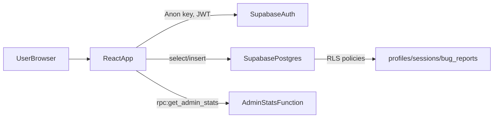

## Security Model

- **Architecture**: React + Vite single-page app using `@supabase/supabase-js` from the browser.
- **Primary protection**: Postgres Row Level Security (RLS) on all user-related tables.
- **Trust boundaries**:
  - Browser / client: untrusted. Assumed fully under user control.
  - Supabase Postgres: trusted, enforces access via RLS and policies.
  - Admin functions (e.g. `get_admin_stats`): trusted, must verify caller is an admin in the database.

## Supabase and RLS Expectations

- **profiles**
  - RLS is enabled.
  - Users can only `select/insert/update` their own row: policies are based on `auth.uid() = id`.
  - `role` defaults to `user`; admin access is expressed via `role = 'admin'`.

- **sessions**
  - RLS is enabled.
  - Users can only `select/insert` rows where `user_id = auth.uid()`.
  - Used to store training runs (speed reading, rapid recall, keyword scanning).

- **bug_reports**
  - RLS is enabled.
  - Authenticated users may insert with `user_id = auth.uid()`.
  - Anonymous users may insert only when `user_id is null`.
  - Only admins (profiles rows with `role = 'admin'`) may `select` bug reports.
  - Database constraints limit:
    - `length(description) <= 4000`
    - `page_url is null or length(page_url) <= 255`

- **Admin functions**
  - `public.get_admin_stats()` is `SECURITY DEFINER` with `search_path = public`.
  - It must (and does) verify `auth.uid()` has `role = 'admin'` in `public.profiles` before returning any data.
  - Any new admin-only functions MUST follow the same pattern: explicit role check before accessing data.

## Environment Variables and Keys

- The app uses:
  - `VITE_SUPABASE_URL`
  - `VITE_SUPABASE_ANON_KEY`
- These are configured in `.env.local` (or your deployment platform’s env settings) and **must never be committed**.
  - `.gitignore` is configured to ignore `*.env*` and `*.local`.
- The Supabase anon key is expected to be public to the browser, but:
  - If it is ever leaked in a public repository, **rotate the key** in the Supabase dashboard and redeploy.
  - After rotation, update the environment variables wherever the app is deployed.

## Logging and Error Handling

- `src/lib/logger.ts`:
  - In development, `info()` / `warn()` / `error()` log to the console.
  - Outside development, common PII keys (e.g. `email`, `user_id`, `full_name`, `first_name`, `last_name`, `entry_year`, `stream`) are automatically redacted from metadata passed to `warn()` / `error()`.
- **Guidelines**:
  - User-facing error messages should be **generic** (e.g. “Unable to load dashboard. Please try again later.”).
  - Detailed error information should go only to the logger, not to the UI.
  - Do not log raw passwords, magic-link tokens, or other secrets.

## Input Validation and Storage

- **Dashboard target WPM**:
  - Users configure a personal WPM target via a controlled numeric input (no `window.prompt`).
  - Values are strictly validated on the client to be between 200 and 900 WPM before saving to `localStorage`.

- **Home page training settings**:
  - WPM, time limits, keyword counts and difficulty are all bounded (e.g. WPM clamped between configured min/max).
  - The `mode` query parameter is validated via a type-guard function; unknown values fall back to a safe default.
  - Future query parameters should follow the same pattern: explicit validation and safe fallbacks.

- **Guest sessions and localStorage**:
  - Guest training history is stored only on the device via `localStorage`.
  - Treat this data as non-sensitive but visible to anyone using the same browser profile.
  - On sign-in, guest sessions are merged into the authenticated account and cleared from `localStorage`.

- **Bug reports**:
  - Client-side:
    - Description is trimmed, limited to 3000 characters, and required.
    - `page_url` is optional, normalized to a site-local path (e.g. `/dashboard?mode=speed_reading`) and capped at 255 characters.
  - Server-side:
    - Length constraints are enforced in the `bug_reports` table as described above.

## Checklist for New Features

When adding new features, use this checklist:

1. **Data modeling**
   - Does the feature require a new table or column?
   - Enable RLS immediately on any table that stores user-related data.
   - Add policies that restrict all operations via `auth.uid()` or explicit role checks.

2. **User input**
   - List all inputs (form fields, URL params, localStorage values).
   - Apply client-side validation (type checks, range checks, length limits).
   - Treat all input as untrusted until validated.

3. **Rendering**
   - Never render user-provided content via `dangerouslySetInnerHTML` or `innerHTML`.
   - Keep feedback, descriptions, and names rendered as plain text.

4. **Logging**
   - Use the namespaced logger and avoid logging sensitive fields directly.
   - Keep user-facing error messages generic.

5. **Secrets and configuration**
   - Store secrets and keys only in environment variables, not in source files.
   - Ensure `.env*` files remain ignored by version control.

